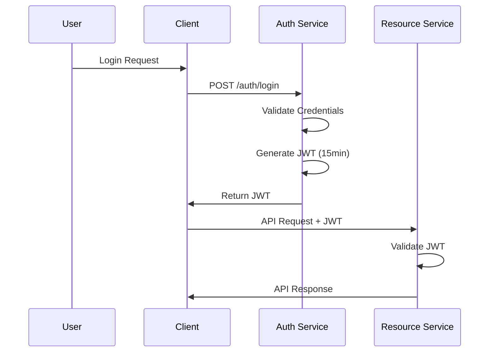
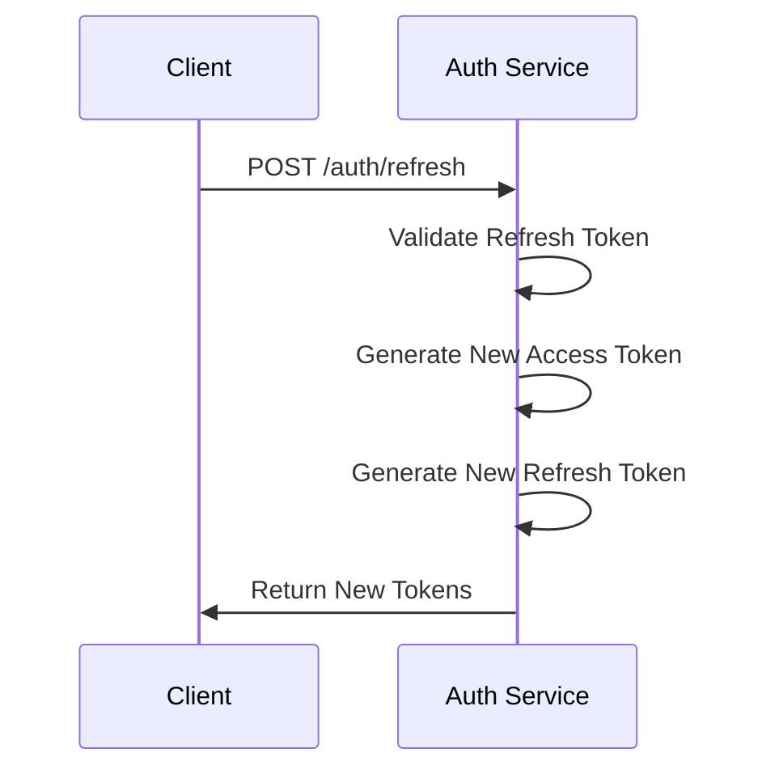

# JWT Security Policy & Key Rotation

## Overview

This document defines comprehensive JWT security policies, key rotation procedures, and SLO requirements for authentication and authorization.

## JWT Configuration Standards

### Token Configuration

```yaml
# JWT Configuration
JWT_SECRET: "base64-encoded-256-bit-secret"
JWT_ALGORITHM: "HS256"
JWT_ACCESS_TOKEN_EXPIRE_MINUTES: 15
JWT_REFRESH_TOKEN_EXPIRE_DAYS: 7
JWT_ISSUER: "dating-app"
JWT_AUDIENCE: "dating-users"
```

### Token Structure

```json
{
  "header": {
    "alg": "HS256",
    "typ": "JWT"
  },
  "payload": {
    "sub": "user_id",
    "iss": "dating-app",
    "aud": "dating-users",
    "iat": 1640995200,
    "exp": 1640996100,
    "type": "access|refresh",
    "scope": "user|admin"
  }
}
```

## SLO Requirements

### Performance Targets

| Metric | Target | Measurement |
|--------|--------|-------------|
| JWT Generation | < 50ms | 95th percentile |
| JWT Validation | < 10ms | 95th percentile |
| Refresh Token Flow | < 150ms | 95th percentile |
| Login Response | < 200ms | 95th percentile |
| Token Revocation | < 100ms | 95th percentile |

### Availability Targets

| Service | Target | Measurement |
|---------|--------|-------------|
| Auth Service | 99.9% | Monthly uptime |
| JWT Validation | 99.95% | Success rate |
| Token Refresh | 99.9% | Success rate |

## Key Rotation Policy

### Rotation Schedule

- **JWT_SECRET**: Rotate every 90 days
- **Emergency rotation**: Within 24 hours of suspected compromise
- **Planned rotation**: First Sunday of each quarter

### Rotation Procedure

#### 1. Pre-Rotation Checklist

```bash
# Verify current JWT configuration
curl -H "Authorization: Bearer $TOKEN" http://localhost:8080/api/v1/auth/verify

# Check token expiration times
jwt decode $TOKEN --no-verify

# Verify backup procedures
./scripts/backup-jwt-keys.sh
```

#### 2. Key Generation

```bash
#!/bin/bash
# Generate new JWT secret
NEW_JWT_SECRET=$(python3 -c "import secrets; print(secrets.token_urlsafe(32))")
echo "New JWT secret: $NEW_JWT_SECRET"

# Store in secure location
echo "$NEW_JWT_SECRET" > /secure/jwt-secret-new.txt
chmod 600 /secure/jwt-secret-new.txt
```

#### 3. Gradual Rollout

```yaml
# Phase 1: Deploy with both old and new secrets
JWT_SECRET: "${OLD_JWT_SECRET}"
JWT_SECRET_NEW: "${NEW_JWT_SECRET}"
JWT_ROTATION_MODE: "dual"

# Phase 2: Switch to new secret only
JWT_SECRET: "${NEW_JWT_SECRET}"
JWT_ROTATION_MODE: "new"
```

#### 4. Validation

```bash
# Test new tokens
curl -H "Authorization: Bearer $NEW_TOKEN" http://localhost:8080/api/v1/auth/verify

# Test old tokens (should fail)
curl -H "Authorization: Bearer $OLD_TOKEN" http://localhost:8080/api/v1/auth/verify

# Monitor error rates
curl http://localhost:9090/api/v1/query?query=jwt_validation_errors_total
```

### Emergency Rotation Playbook

#### 1. Immediate Response (0-15 minutes)

```bash
# Revoke all active tokens
./scripts/revoke-all-tokens.sh

# Generate new secret
NEW_SECRET=$(python3 -c "import secrets; print(secrets.token_urlsafe(32))")

# Update environment
export JWT_SECRET="$NEW_SECRET"
```

#### 2. Service Update (15-30 minutes)

```bash
# Update all services
docker compose up -d api-gateway auth-service admin-service telegram-bot

# Verify services are healthy
./scripts/health_check.sh
```

#### 3. User Notification (30-60 minutes)

```bash
# Send notification to all users
./scripts/notify-token-rotation.sh

# Update client applications
# Force re-authentication
```

## Token Lifecycle Management

### Access Token Flow



### Refresh Token Flow



### Token Revocation

```python
# Token blacklist implementation
class TokenBlacklist:
    def __init__(self, redis_client):
        self.redis = redis_client
    
    def revoke_token(self, token_jti: str, expires_at: int):
        """Add token to blacklist until expiration"""
        ttl = expires_at - int(time.time())
        if ttl > 0:
            self.redis.setex(f"blacklist:{token_jti}", ttl, "revoked")
    
    def is_revoked(self, token_jti: str) -> bool:
        """Check if token is blacklisted"""
        return self.redis.exists(f"blacklist:{token_jti}")
```

## Security Monitoring

### Metrics to Track

```yaml
# Prometheus metrics
jwt_tokens_generated_total{type="access|refresh"}
jwt_tokens_validated_total{result="valid|invalid"}
jwt_validation_duration_seconds
jwt_token_expiry_seconds{type="access|refresh"}
jwt_rotation_events_total{status="success|failure"}
```

### Alerting Rules

```yaml
# High JWT validation failure rate
- alert: HighJWTValidationFailureRate
  expr: rate(jwt_tokens_validated_total{result="invalid"}[5m]) > 0.1
  for: 2m
  labels:
    severity: warning
  annotations:
    summary: "High JWT validation failure rate"
    description: "JWT validation failure rate is {{ $value }} failures per second"

# JWT rotation failure
- alert: JWTRotationFailure
  expr: increase(jwt_rotation_events_total{status="failure"}[1h]) > 0
  for: 0m
  labels:
    severity: critical
  annotations:
    summary: "JWT key rotation failed"
    description: "JWT key rotation has failed {{ $value }} times in the last hour"
```

## Implementation Examples

### JWT Middleware

```python
import jwt
from datetime import datetime, timedelta
from typing import Optional, Dict, Any

class JWTHandler:
    def __init__(self, secret: str, algorithm: str = "HS256"):
        self.secret = secret
        self.algorithm = algorithm
    
    def generate_token(self, user_id: str, token_type: str = "access") -> str:
        """Generate JWT token"""
        now = datetime.utcnow()
        payload = {
            "sub": user_id,
            "iss": "dating-app",
            "aud": "dating-users",
            "iat": now,
            "type": token_type,
            "scope": "user"
        }
        
        if token_type == "access":
            payload["exp"] = now + timedelta(minutes=15)
        else:  # refresh
            payload["exp"] = now + timedelta(days=7)
        
        return jwt.encode(payload, self.secret, algorithm=self.algorithm)
    
    def validate_token(self, token: str) -> Optional[Dict[str, Any]]:
        """Validate JWT token"""
        try:
            payload = jwt.decode(
                token, 
                self.secret, 
                algorithms=[self.algorithm],
                issuer="dating-app",
                audience="dating-users"
            )
            return payload
        except jwt.ExpiredSignatureError:
            return None
        except jwt.InvalidTokenError:
            return None
```

### Rate Limiting for Auth Endpoints

```python
from aiohttp import web
from aiohttp_ratelimit import RateLimiter

# Rate limiting for auth endpoints
auth_rate_limiter = RateLimiter(
    calls=10,  # 10 attempts
    period=300  # per 5 minutes
)

@auth_rate_limiter
async def login_handler(request: web.Request) -> web.Response:
    # Login logic here
    pass
```

## Testing Procedures

### JWT Security Tests

```python
import pytest
import jwt
from datetime import datetime, timedelta

class TestJWTSecurity:
    def test_token_generation(self):
        """Test JWT token generation"""
        handler = JWTHandler("test-secret")
        token = handler.generate_token("user123")
        
        assert token is not None
        payload = jwt.decode(token, "test-secret", algorithms=["HS256"])
        assert payload["sub"] == "user123"
        assert payload["type"] == "access"
    
    def test_token_expiration(self):
        """Test token expiration"""
        handler = JWTHandler("test-secret")
        
        # Create expired token
        payload = {
            "sub": "user123",
            "exp": datetime.utcnow() - timedelta(minutes=1)
        }
        expired_token = jwt.encode(payload, "test-secret", algorithm="HS256")
        
        result = handler.validate_token(expired_token)
        assert result is None
    
    def test_invalid_signature(self):
        """Test invalid token signature"""
        handler = JWTHandler("test-secret")
        
        # Create token with wrong secret
        payload = {"sub": "user123"}
        invalid_token = jwt.encode(payload, "wrong-secret", algorithm="HS256")
        
        result = handler.validate_token(invalid_token)
        assert result is None
```

## Compliance & Auditing

### Audit Logging

```python
import logging
from datetime import datetime

class JWTAuditLogger:
    def __init__(self):
        self.logger = logging.getLogger("jwt_audit")
    
    def log_token_generation(self, user_id: str, token_type: str):
        """Log token generation"""
        self.logger.info({
            "event": "token_generated",
            "user_id": user_id,
            "token_type": token_type,
            "timestamp": datetime.utcnow().isoformat()
        })
    
    def log_token_validation(self, user_id: str, result: str):
        """Log token validation"""
        self.logger.info({
            "event": "token_validated",
            "user_id": user_id,
            "result": result,
            "timestamp": datetime.utcnow().isoformat()
        })
    
    def log_key_rotation(self, old_key_id: str, new_key_id: str):
        """Log key rotation"""
        self.logger.info({
            "event": "key_rotated",
            "old_key_id": old_key_id,
            "new_key_id": new_key_id,
            "timestamp": datetime.utcnow().isoformat()
        })
```

### Compliance Checklist

- [ ] JWT secrets are rotated every 90 days
- [ ] All tokens have appropriate expiration times
- [ ] Token validation is performed on every request
- [ ] Failed authentication attempts are logged
- [ ] Key rotation procedures are tested quarterly
- [ ] Emergency rotation playbook is documented
- [ ] Audit logs are retained for 1 year
- [ ] Performance targets are monitored and met
