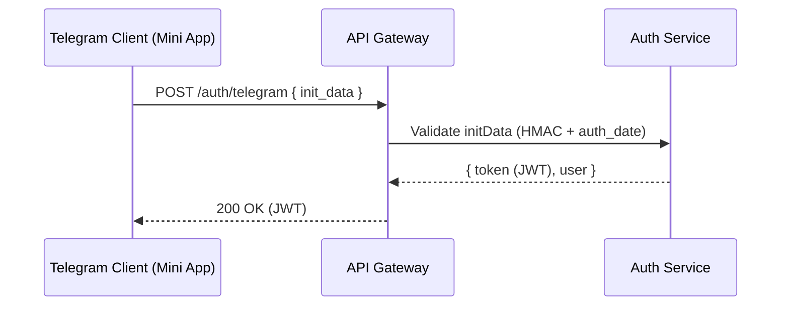
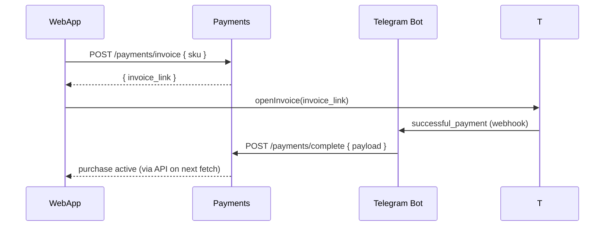
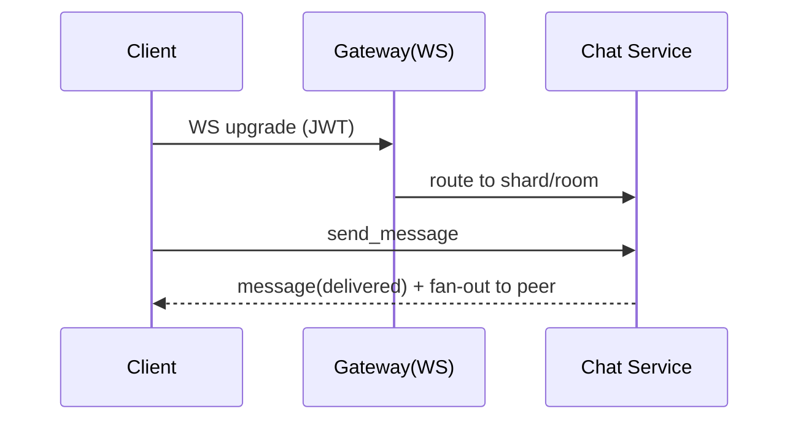

# SPEC.md — Полное ТЗ: Dating Mini App (Telegram)

**Формат:** Telegram Mini App (WebApp) + бот‑транспорт (уведомления/платежи).  
**Статус:** Production Ready (не MVP), с полным функциональным и нефункциональным покрытием.

---

## 0. Глоссарий

- **Mini App / WebApp** — веб‑приложение, запускаемое внутри Telegram.
- **Stars/XTR** — внутренняя валюта Telegram для платежей цифровых услуг.
- **StartApp deep‑link** — ?startapp=<param>, открывает мини‑приложение на нужном экране.
- **JWT** — токен серверной сессии, выдаётся после валидации initData.
- **WS** — WebSocket‑канал для чатов и событий.
- **PII** — персональные данные.
- **ER‑модель** — модель сущностей и связей БД.
- **SLO/SLA** — цели и соглашения по уровню сервиса.
- **IaC** — инфраструктура как код (Terraform/Helm).

---

## 1. Цели и границы проекта

### 1.1. Цели

Создать безопасный, масштабируемый и монетизируемый сервис знакомств, целиком работающий внутри Telegram Mini App.

Обеспечить высокий retention, быструю конверсию в первый матч, качественную модерацию/безопасность, стабильные платежи в Stars.

### 1.2. В Scope (продакш‑реди)

- Полный онбординг, анкета, медиа‑галерея, гео (с сохранением приватности).
- Discovery/свайпы, фильтры, лайки/суперлайки, матчи, избранное.
- Чаты (реал‑тайм WS), вложения (фото/видео/голос), рид‑реситы, typing/presence.
- Платежи/подписки/бусты/пакеты суперлайков через Stars; возвраты.
- Уведомления ботом (новые лайки/матчи/сообщения), deep‑links startapp.
- Продвинутая модерация (автомат/ручная), центр безопасности, репорты/блок.
- Алгоритмы подбора: от эвристик → двухбашенная модель + rerank + A/B.
- Полная аналитика и телеметрия, антиспам/антифрод.
- SRE‑компоненты: SLO/алерты, бэкапы/DR, observability, DevSecOps.
- Мульти‑региональная готовность и катастрофоустойчивость.
- Полный комплаенс: 18+, приватность, удаление/экспорт данных, политики.

### 1.3. Вне Scope

- Звонки/видео‑звонки в первом релизе (могут быть roadmap v2).
- Верификация по документам (пока — селфи‑верификация по согласию).

---

## 2. Персоны и ключевые сценарии

### Персоны

- **Seeker (18–35):** быстрые мэтчи, удобный чат, бусты.
- **Chooser (25–45):** качественные фильтры, «кто меня лайкнул», приватность.
- **Moderator:** обработка жалоб, решения, аудит.
- **Admin/Analyst:** метрики, тарифы, AB‑тесты, промо.

### Сценарии (критические пути)

- Первый запуск → онбординг ≤ 60 сек → первые кандидаты → лайк → матч → первое сообщение.
- Платёж (буст/подписка) → моментальная активация услуги.
- Репорт/блок → модерация → решение → обратная связь пользователю.
- Уведомление о сообщении/матче → deeplink → открытие целевого экрана.

---

## 3. Функциональные требования

### 3.1 Онбординг

- Автологин Mini App: клиент передаёт initData; сервер валидирует HMAC, auth_date; выдаёт JWT с TTL 24ч.
- Анкета: имя, дата рождения (18+), пол/ориентация, цель, интересы (тэги), рост/образование/привычки (опц.), «о себе».
- Медиа: ≥1 фото, drag‑sort, EXIF‑очистка, NSFW/плагиат‑детекция.
- Гео: запрос через Mini App API; при отказе — ручной выбор города; хранение округлённого геохеша (приватность).
- Приватность: скрыть расстояние/онлайн/возраст (опц.), кто может писать первым.
- Разрешение уведомлений: requestWriteAccess бот‑каналу (для триггеров).
- Приёмка: пройти онбординг за ≤ 60 сек; без гео — корректная fallback‑выдача по городу; некорректные фото — объяснимые ошибки.

### 3.2 Discovery/свайпы

- Карточки с фото/видео, бейджами интересов, верификацией.
- Действия: лайк/дизлайк/суперлайк, «в избранное», репорт/блок, share (реферальный).
- Фильтры: возраст, радиус, цель, рост, дети, привычки, образование, верификация.
- Лимиты: дневной лимит лайков (free), суперлайки/бусты — платные.
- Пустые состояния: расширение радиуса/фильтров, предложение буста.

### 3.3 Матчи и чат

- Матч при взаимном лайке; список матчей (сортировка по свежести).
- Чат: текст, изображения, видео (короткие клипы), голосовые, стикеры, эмодзи‑реакции.
- Рид‑реситы (в тарифах), typing/presence, блок/репорт из чата.
- Режим «ледоколы»: шаблоны вопросов/подсказки.

### 3.4 Уведомления и ретеншн

- Бот‑уведомления о лайках/матчах/сообщениях с deep‑link startapp на нужный экран.
- Настройки частоты/типа уведомлений; «тихий час» по локальному времени.
- Рефералка и share: персональные реф‑параметры (атрибуция в startapp).

### 3.5 Монетизация (Stars)

- Подписки (Lite/Pro/Max): расширенные фильтры, «кто меня лайкнул», рид‑реситы, бусты/мес, приоритет в ленте.
- Разовые покупки: бусты (30 мин), пакеты суперлайков, приоритет‑спотлайт.
- Платёжный флоу: invoice link для XTR → openInvoice → successful_payment → активация; возвраты.
- История покупок, квитанции, состояние подписки, авто‑продление.

### 3.6 Модерация и безопасность

- Авто‑модерация: NSFW/миноры/спам/массовые лайки/бот‑паттерны; пороги и эвристики.
- Ручная модерация: очередь жалоб, карточка пользователя, решения (удалить контент, предупреждение, скрытие/бан), аудит.
- Центр безопасности: советы, «паническая кнопка», быстрый репорт, гайд по приватности.
- Верификация: селфи‑проверка (по согласию), бейдж верификации.

### 3.7 Управление аккаунтом

- Редактирование профиля/медиа/настроек; пауза аккаунта; экспорт/удаление данных; история действий (безопасность входов).

### 3.8 Админ‑панель/аналитика

- Дашборды: DAU/WAU/MAU, funnel, retention, ARPPU/LTV, метрики алгоритмов (like/match/reply rate), платежи/рефанды.
- Управление тарифами/скидками/буст‑параметрами.
- A/B‑тесты: раздача бакетов, аналитика, SRM‑чек.

---

## 4. Нефункциональные требования (качество сервиса)

- **Производительность:** TTFB API ≤ 150 мс (p95), рендер первого экрана ≤ 1.5 с (cold), ≤ 0.7 с (warm), доставка WS‑сообщений ≤ 1 с.
- **Доступность:** SLO аптайм 99.95% в месяц (API/WS).
- **Масштаб:** ≥ 20k RPS на /discover (горизонтально), ≥ 100k одновременных WS.
- **Безопасность:** соответствие лучшим практикам (TLS 1.2+, CSP, rate‑limits, секреты в KMS, журнал аудита).
- **Приватность:** минимизация PII, гео — округлённый геохеш, удаление EXIF, право на удаление и экспорт.
- **Мульти‑регион:** актив‑актив для чтений, актив‑пассив/актив‑актив для критичных сервисов, RPO ≤ 15 мин, RTO ≤ 2 ч.

---

## 5. Архитектура

### 5.1 Компоненты

**Telegram Bot (webhook):** уведомления, платежные события, deep‑links.

**Mini App (SPA, React/TS):** UI/роутер/темы Telegram, bridge к WebApp API.

**API Gateway:** JWT‑аутентификация, rate‑limits, трейсинг, идемпотентность.

**Сервисы:**

- **Auth** (валидация initData, сессии, JWT).
- **Profile** (анкеты/медиа/настройки/приватность).
- **Discovery/Match** (генерация кандидатов, лайки/суперлайки, матчи).
- **Chat** (WS, хранение сообщений, индикаторы).
- **Payments** (инвойсы XTR, статусы, возвраты).
- **Moderation** (авто/ручная, очереди, санкции).
- **Notifications** (бот‑шлюз, сегментация, ограничения частоты).
- **Recommender** (фичестор, скоринг, A/B).
- **Analytics** (события, BI, эксперименты).

**Хранилища:** PostgreSQL (OLTP), Redis (кэш/сессии/rate), S3‑совместимое хранилище + CDN (медиа), ClickHouse/BigQuery (аналитика), Kafka/Redpanda (стримы), pgvector/FAISS (эмбеддинги).

**Инфра:** Kubernetes, Istio/NGINX Ingress, Prometheus/Grafana, Loki, Jaeger/Tempo, Vault/KMS, Terraform + Helm.

### 5.2 Диаграммы (Mermaid)

#### 5.2.1 Авторизация Mini App



#### 5.2.2 Платёж Stars



#### 5.2.3 Чат (WS)



---

## 6. Интеграция с Telegram (кратко)

- **Инициализация:** window.Telegram.WebApp (initData, темы, BackButton, Haptic).
- **Разрешения:** requestWriteAccess, requestContact (опц.).
- **Гео:** LocationManager (с согласием), fallback — выбор города.
- **Запуск:** Main Mini App + startapp параметр (deeplink).
- **Платежи:** invoice link и openInvoice (XTR); обработка successful_payment; возвраты.
- **Хранилища на клиенте:** CloudStorage/DeviceStorage/SecureStorage (кэш/настройки).

---

## 7. Модель данных (ER → DDL)

### 7.1 Ключевые таблицы

- `users(id, tg_id, username, is_premium, created_at, banned)`
- `profiles(user_id, name, birth_date, gender, orientation, bio, city, geohash, height_cm, kids, habits, education, interests[])`
- `photos(id, user_id, url, sort_order, safe_score, created_at)`
- `likes(id, from_user, to_user, type: like|superlike, created_at, unique (from_user,to_user))`
- `matches(id, user_a, user_b, state, created_at, unique pair)`
- `messages(id, match_id, sender_id, type: text|image|voice|video, text, media_url, created_at, read_by[])`
- `favorites(user_id, target_user_id, created_at, unique pair)`
- `reports(id, reporter_id, target_user_id, reason, details, created_at, status)`
- `purchases(id, user_id, sku, amount_units, status, payload, meta, created_at)`
- `ab_tests(user_id, key, variant, assigned_at)`
- `algo_features(user_id, vector, updated_at)` (pgvector)

**Индексы:** geohash, created_at, GIN/GIST по полнотексту/массивам (где уместно).

### 7.2 Инварианты

- Возраст ≥ 18 (серверная валидация по birth_date).
- Уникальность пары (матч): least(user_a,user_b), greatest(user_a,user_b).
- Идемпотентность покупок по payload.

---

## 8. API (контракты)

### 8.1 Аутентификация

- `POST /auth/telegram` — `{ init_data }` → `{ token, user }`
- Проверка HMAC + свежесть auth_date.
- JWT TTL 24ч, рефреш по повторной валидации initData.

### 8.2 Профиль/медиа

- `GET /me`, `PUT /me`, `POST /me/photo`, `DELETE /me/photo/:id`
- `GET /users/:id` (публичная часть без приватных полей)

### 8.3 Discovery/матчи

- `GET /discover?limit&cursor&filters…` — кандидаты (с пагинацией).
- `POST /like { target_id, type }` → `{ match_id? }`
- `POST /pass { target_id }`
- `GET /matches?cursor` — список матчей.

### 8.4 Избранное

- `POST /favorites { target_id }`, `DELETE /favorites/:target_id`, `GET /favorites`

### 8.5 Чат

- WS `/ws` (JWT при апгрейде), комнаты по match_id.
- REST: `GET /messages?match_id&cursor`, `POST /attachments`, `POST /chat/close`.

### 8.6 Платежи Stars

- `POST /payments/invoice { sku }` → `{ invoice_link }`
- `POST /payments/complete` (webhook‑внутр. вызов от бота)
- `GET /purchases` — история
- `POST /payments/refund { id }` (админ)

### 8.7 Модерация/репорты

- `POST /report`, `POST /block`, `GET /moderation/queue`, `POST /moderation/resolve`

### 8.8 Ошибки (единый формат)

```json
{ "error": { "code": "string", "message": "string", "details": { } } }
```

**Коды:** invalid_init_data, validation_error, rate_limited, payment_failed, forbidden, not_found, conflict, gone.

---

## 9. Рекомендательные алгоритмы

- **Кандидатогенерация:** фильтры (пол/ориентация/возраст/радиус), свежесть, блоки/репорты, diversity, cooldown дизлайков.
- **Скоринг v1:** логрег/GBM (расстояние, заполненность профиля, engagement, жалобы, совместимость интересов, новизна).
- **Скоринг v2:** двухбашенная модель эмбеддингов (user/item), feature store (онлайн/оффлайн), rerank правила (fairness, diversity, бизнес‑ограничения).
- **Обучение и A/B:** оффлайн метрики (ROC/AUC/NDCG), онлайн — like/match/reply rate, time‑to‑first‑msg; SRM‑чек, CUPED, корректировки.

---

## 10. Безопасность/приватность/комплаенс

- Минимизация PII; гео — округлённый геохеш; EXIF‑удаление; медиадоступ — подписанные URL с TTL.
- Хранение секретов: Vault/KMS; ротация ключей ≤ 90 дней.
- Шифрование: TLS 1.2+, HSTS; at‑rest для БД/бэкапов.
- Политики доступа: RBAC, принцип наименьших привилегий; админ/модератор — через отдельный IdP.
- Журнал аудита: все админ/модераторские действия с неизменяемыми логами.
- Права пользователя: экспорт/удаление профиля и контента; SLA удаления ≤ 30 дней; логич. удаление + физич. сборщик.
- Статическая/динамическая безопасность: SAST/DAST, контейнер‑скан, зависимостям — CVE‑алерты.
- Threat model (STRIDE): спуфинг initData → HMAC; реплеи → TTL/nonce; DoS → rate‑limits/WAF; утечка PII → минимизация/классификация/шифрование.

---

## 11. Observability/SRE

- **Метрики:** latency p50/p95/p99, RPS/WS‑коннекты, error rate, drop/timeout, очередь модерации, платёжные статусы, ретраи, storage usage.
- **Логи:** структурированные, PII‑редакция, trace‑ID; хранение 14–30 дней.
- **Трейсинг:** OpenTelemetry (gateway→services→DB/CDN).
- **Алерты:** бюджет ошибок SLO, деградация платежей, рост отказов WS, рост репортов/спама.
- **СLO:** 99.95% аптайм (API/WS), время восстановления инцидента ≤ 60 мин (P1).

---

## 12. Производительность/ёмкость/DR

- Кэширование discovery‑пулов и профилей (Redis), CDN‑кеш на медиа.
- Горизонтальное масштабирование WS (шардинг/rooms), sticky‑сессии через cookie/headers.
- Бэкапы БД: PITR; S3‑версии; тест восстановления ежемесячно.
- DR: актив‑пасив либо актив‑актив; RPO ≤ 15 мин, RTO ≤ 2 ч; чёткий playbook.

---

## 13. i18n/a11y

- RU/EN на старте; ICU‑плюрализация; динамическая загрузка локалей.
- Контраст, фокус‑индикаторы, большие тач‑таргеты; screen reader‑альты.

---

## 14. DevEx/CI‑CD

- **Репозиторий:** монорепо (apps/webapp, apps/api, services/*, infra/*, docs/*).
- **CI:** линт/формат/юниты/интеграция, SAST/лицензии.
- **CD:** staging → canary 10% → prod; автопромо при SLO OK; автооткат при алертах.
- **IaC:** Terraform (VPC, K8s, DB, Redis, S3/CDN, WAF), Helm (чарты сервисов).
- **Секреты:** OIDC → KMS; доступы — GitHub Environments.

---

## 15. Тестирование

- **Юнит:** ≥ 80% критических модулей (Auth/Payments/Match/Chat/Moderation).
- **Интеграционные:** initData→JWT; openInvoice→successful_payment; WS‑чат (rooms).
- **E2E (на реальном Telegram окружении):** онбординг; лайк→матч→чат; покупка/активация/возврат; репорт→решение; удаление аккаунта.
- **Нагрузочные:** 20k RPS /discover, 100k WS; профилирование; мониторинг GC.
- **Безопасность:** негативные кейсы HMAC, CSRF/CORS/CSP, XSS/SSRF, rate limits, ограничение вложений (размер/тип), fuzzing API.

---

## 16. Релизы, фичефлаги, миграции

- **Фичефлаги:** server‑side + client‑side guard, rollout по %/стране/бакету.
- **Миграции БД:** транзакционные, backward‑compatible; протокол отката.
- **Выпуск:** релиз‑ноуты; внутренние гайды саппорту.

---

## 17. Риски и смягчение

- Низкая плотность пользователей → межгородская выдача off‑hours; буст промо.
- Спам/фрод → ML + поведенческие лимиты, челленджи, туннелирование трафика.
- Платежные сбои → идемпотентность, ретраи вебхуков, ручной refund, алерты.
- Репутационные риски (небезопасный контент) → строгие пороги авто‑модерации, быстрый human‑review SLA.

---

## 18. Матрица фич по тарифам (пример)

| Фича | Free | Lite | Pro | Max |
|------|------|------|-----|-----|
| Дневной лимит лайков | 50 | 100 | 200 | 400 |
| Расширенные фильтры | — | ✓ | ✓ | ✓ |
| «Кто лайкнул меня» | — | — | ✓ | ✓ |
| Рид‑реситы | — | — | ✓ | ✓ |
| Бусты/мес | — | 1 | 3 | 5 |
| Суперлайки/мес | — | 5 | 20 | 50 |
| Приоритет в ленте | — | — | — | ✓ |

---

## 19. Таксономия событий (аналитика, фрагмент)

- `app_open`, `onboarding_start|finish`, `profile_update`, `photo_upload|rejected`
- `card_view`, `like_sent|received`, `superlike_sent`, `match_created`
- `message_sent|received`, `read`, `typing`
- `purchase_started|completed|refunded`, `subscription_renewed|expired`
- `report_sent`, `moderation_action`, `ban_applied|removed`

**Схема события:** `{ event, user_id, ts, props{}, ab_bucket }`

---

## 20. Шаблоны ошибок/UX‑копирайтинг (фрагменты)

- «Не удалось верифицировать сессию. Повторите запуск из Telegram.»
- «Оплата получена. {benefit} активирован(а).»
- «Контент нарушает правила. Фото отклонено: {reason}.»

---

## 21. Эпики, сторисы и GitHub‑issues

Ниже — WBS: разбивка на эпики → задачи (issues). У каждой — Scope, Acceptance Criteria, DoR, DoD, Зависимости, Оценка.
