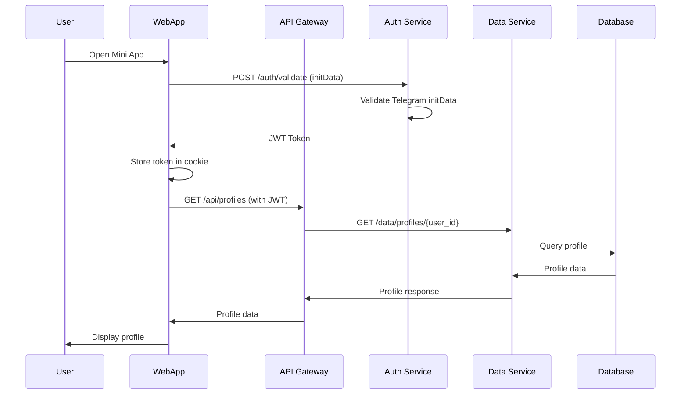
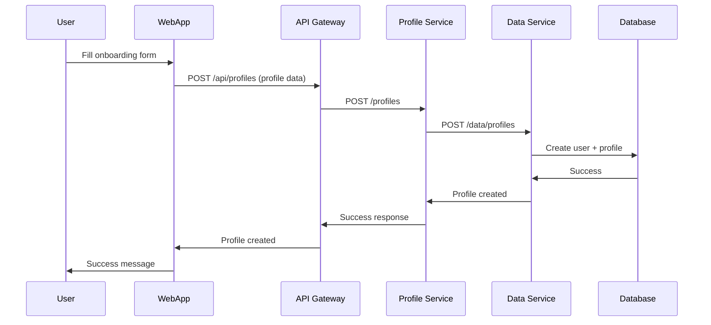
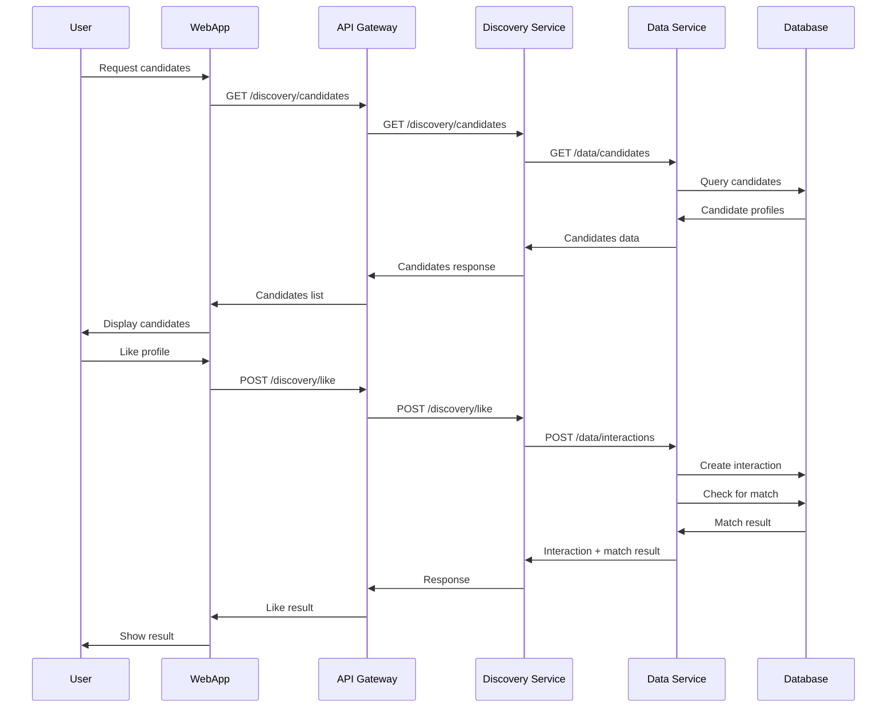
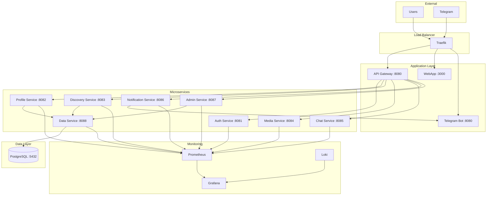
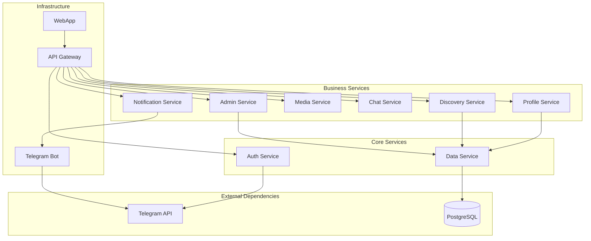

# 🏗️ Architecture Overview

## 📋 Table of Contents

- [System Overview](#system-overview)
- [Microservices Architecture](#microservices-architecture)
- [Data Flow](#data-flow)
- [Technology Stack](#technology-stack)
- [Deployment Architecture](#deployment-architecture)
- [Security Architecture](#security-architecture)
- [Monitoring & Observability](#monitoring--observability)

---

## 🎯 System Overview

Dating is a modern Telegram Mini App for dating with a microservices architecture. The application provides:

- **User Authentication** via Telegram WebApp
- **Profile Management** with photo uploads and validation
- **Discovery & Matching** algorithm for finding compatible partners
- **Real-time Chat** between matched users
- **Admin Panel** for moderation and system management
- **Push Notifications** via Telegram Bot

### Key Design Principles

1. **Microservices Architecture** - Each service has a single responsibility
2. **Centralized Data Access** - All database operations go through Data Service
3. **API Gateway Pattern** - Single entry point for all client requests
4. **Event-Driven Communication** - Services communicate via HTTP APIs
5. **Containerized Deployment** - Docker-based deployment with Docker Compose

---

## 🏛️ Microservices Architecture

### Core Services

#### 🔐 Auth Service (`auth-service:8081`)
**Responsibility**: Authentication and JWT token management

**Endpoints**:
- `POST /auth/validate` - Validate Telegram WebApp initData and generate JWT
- `GET /auth/verify` - Verify JWT token
- `POST /auth/refresh` - Refresh JWT token
- `GET /health` - Health check

**Key Features**:
- Telegram WebApp initData validation
- JWT token generation and validation
- Rate limiting for security
- Platform-independent authentication

#### 👤 Profile Service (`profile-service:8082`)
**Responsibility**: User profile management

**Endpoints**:
- `GET /profiles/{user_id}` - Get user profile
- `POST /profiles` - Create user profile
- `GET /health` - Health check

**Key Features**:
- Profile CRUD operations
- Works through Data Service (no direct DB access)
- Handles profile creation from onboarding flow

#### 🔍 Discovery Service (`discovery-service:8083`)
**Responsibility**: Matching algorithm and candidate discovery

**Endpoints**:
- `GET /discovery/candidates` - Get candidate profiles for matching
- `POST /discovery/like` - Like/superlike/pass a profile
- `GET /discovery/matches` - Get user's matches
- `GET /health` - Health check

**Key Features**:
- Advanced matching algorithm
- Filtering by age, location, interests, etc.
- Interaction tracking (like, superlike, pass)
- Match detection and creation

#### 📸 Media Service (`media-service:8084`)
**Responsibility**: Photo/video upload and processing

**Endpoints**:
- `POST /media/upload` - Upload media file
- `GET /media/{file_id}` - Get media file
- `DELETE /media/{file_id}` - Delete media file
- `GET /health` - Health check

**Key Features**:
- File upload handling
- Image optimization
- NSFW detection (configurable threshold)
- Secure file storage

#### 💬 Chat Service (`chat-service:8085`)
**Responsibility**: Real-time messaging between matched users

**Endpoints**:
- `WS /chat/connect` - WebSocket connection for real-time chat
- `GET /chat/conversations` - Get user conversations
- `GET /chat/messages/{conversation_id}` - Get messages for conversation
- `POST /chat/messages` - Send message
- `GET /health` - Health check

**Key Features**:
- WebSocket-based real-time communication
- Message history
- Conversation management
- Message delivery status

#### 🔔 Notification Service (`notification-service:8086`)
**Responsibility**: Push notifications via Telegram Bot

**Endpoints**:
- `POST /api/notifications/send_match` - Send match notification
- `POST /api/notifications/send_message` - Send message notification
- `POST /api/notifications/send_like` - Send like notification
- `GET /health` - Health check

**Key Features**:
- Integration with Telegram Bot API
- Notification queuing and delivery
- Error handling and retries
- Structured logging

#### 👨‍💼 Admin Service (`admin-service:8087`)
**Responsibility**: Administrative panel and system management

**Endpoints**:
- `POST /admin/login` - Admin authentication
- `GET /admin/stats` - System statistics
- `GET /admin/users` - User management
- `GET /admin/photos` - Photo moderation
- `GET /health` - Health check

**Key Features**:
- Admin authentication and session management
- User management and moderation
- Photo moderation with NSFW detection
- System statistics and monitoring
- Web-based admin interface

#### 🗄️ Data Service (`data-service:8088`)
**Responsibility**: Centralized database access for all services

**Endpoints**:
- `GET /data/profiles/{user_id}` - Get user profile
- `POST /data/profiles` - Create user profile
- `PUT /data/profiles/{user_id}` - Update user profile
- `GET /data/users` - List users
- `GET /data/stats` - System statistics
- `GET /data/photos` - List photos for moderation
- `GET /data/candidates` - Find matching candidates
- `POST /data/interactions` - Create user interactions
- `GET /data/matches` - Get user matches
- `GET /health` - Health check

**Key Features**:
- Single point of database access
- Data consistency and integrity
- Transaction management
- Query optimization
- Audit logging

### Supporting Services

#### 🌐 API Gateway (`api-gateway:8080`)
**Responsibility**: Request routing and load balancing

**Features**:
- Request routing to appropriate microservices
- CORS handling
- Request/response logging
- Error handling and fallbacks
- Load balancing

#### 🤖 Telegram Bot (`telegram-bot:8080`)
**Responsibility**: Telegram Bot API integration

**Features**:
- `/start` command with WebApp button
- Push notification delivery
- User interaction handling
- Bot configuration management

#### 🖥️ WebApp (`webapp:3000`)
**Responsibility**: Frontend user interface

**Features**:
- Next.js 15 with React 19
- Telegram WebApp integration
- Internationalization (ru/en)
- Responsive design
- Real-time updates

---

## 🔄 Data Flow

### User Authentication Flow



### Profile Creation Flow



### Discovery & Matching Flow



---

## 🛠️ Technology Stack

### Backend Services
- **Python 3.11+** - Main programming language
- **aiohttp** - Async HTTP server framework
- **SQLAlchemy 2.0** - Async ORM
- **asyncpg** - PostgreSQL async driver
- **Alembic** - Database migrations
- **aiogram 3.x** - Telegram Bot framework

### Frontend
- **Next.js 15.5.4** - React framework
- **React 19.1.0** - UI library
- **TypeScript** - Type-safe JavaScript
- **Tailwind CSS v4** - Utility-first CSS
- **shadcn/ui** - Component library
- **TanStack Query v5** - Data fetching
- **next-intl** - Internationalization

### Infrastructure
- **Docker & Docker Compose** - Containerization
- **Traefik** - Reverse proxy and load balancer
- **PostgreSQL 15** - Primary database
- **Prometheus** - Metrics collection
- **Grafana** - Metrics visualization
- **Loki** - Log aggregation
- **Promtail** - Log shipping

### Development & Testing
- **pytest** - Testing framework
- **pytest-asyncio** - Async testing
- **Playwright** - E2E testing
- **ESLint & Prettier** - Code quality
- **GitHub Actions** - CI/CD

---

## 🚀 Deployment Architecture

### Production Deployment



### Service Dependencies



---

## 🔒 Security Architecture

### Authentication & Authorization

1. **Telegram WebApp Authentication**
   - Users authenticate via Telegram's built-in auth
   - initData validation using HMAC-SHA256
   - JWT tokens for session management

2. **JWT Token Management**
   - Short-lived access tokens
   - Refresh token mechanism
   - Secure token storage in HTTP-only cookies

3. **API Security**
   - Rate limiting on all endpoints
   - CORS configuration
   - Request validation and sanitization

### Data Protection

1. **Database Security**
   - Encrypted connections (SSL/TLS)
   - Role-based access control
   - Prepared statements to prevent SQL injection

2. **File Storage Security**
   - Secure file upload validation
   - NSFW content detection
   - Access control for media files

3. **Network Security**
   - HTTPS everywhere
   - Internal service communication over Docker network
   - Firewall rules for external access

---

## 📊 Monitoring & Observability

### Metrics Collection

**Prometheus Metrics**:
- HTTP request metrics (latency, status codes, throughput)
- Database connection pool metrics
- Custom business metrics (matches, profiles, etc.)
- System resource metrics (CPU, memory, disk)

**Grafana Dashboards**:
- Infrastructure Overview
- Application Services
- Application Logs
- Database Metrics

### Logging

**Structured Logging**:
- JSON-formatted logs
- Correlation IDs for request tracing
- Log levels (DEBUG, INFO, WARN, ERROR)
- Centralized log aggregation via Loki

**Log Sources**:
- Application logs from all services
- Access logs from Traefik
- Database logs
- System logs

### Health Checks

**Service Health**:
- HTTP health check endpoints
- Database connectivity checks
- Dependency health verification
- Automated restart on failure

**Monitoring Alerts**:
- Service down alerts
- High error rate alerts
- Resource usage alerts
- Business metric alerts

---

## 🔄 Development Workflow

### Local Development

1. **Prerequisites**:
   - Docker & Docker Compose
   - Node.js 20+ (for WebApp development)
   - Python 3.11+ (for service development)

2. **Quick Start**:
   ```bash
   # Clone repository
   git clone <repository-url>
   cd dating
   
   # Set up environment
   cp .env.example .env
   # Edit .env with your configuration
   
   # Start all services
   docker compose up -d
   
   # Run tests
   pytest
   
   # Start WebApp development
   cd webapp
   npm install
   npm run dev
   ```

### Testing Strategy

1. **Unit Tests** - Test individual functions and classes
2. **Integration Tests** - Test service interactions
3. **End-to-End Tests** - Test complete user workflows
4. **Performance Tests** - Test system under load

### Deployment Process

1. **Development** - Local development with hot reload
2. **Testing** - Automated tests in CI/CD pipeline
3. **Staging** - Deploy to staging environment
4. **Production** - Deploy to production with zero downtime

---

## 📈 Scalability Considerations

### Horizontal Scaling

- **Stateless Services** - All services are stateless and can be scaled horizontally
- **Load Balancing** - Traefik provides load balancing across service instances
- **Database Scaling** - PostgreSQL can be scaled with read replicas

### Performance Optimization

- **Connection Pooling** - Database connection pooling for efficient resource usage
- **Caching** - Redis can be added for caching frequently accessed data
- **CDN** - Static assets can be served via CDN

### Monitoring & Alerting

- **Real-time Monitoring** - Grafana dashboards for real-time system health
- **Automated Alerts** - Prometheus alerts for proactive issue detection
- **Performance Metrics** - Detailed performance metrics for optimization

---

*Last updated: January 2025*
