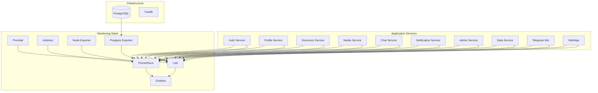

# 📊 Monitoring Guide

## 📋 Table of Contents

- [Overview](#overview)
- [Monitoring Stack](#monitoring-stack)
- [Metrics Collection](#metrics-collection)
- [Log Aggregation](#log-aggregation)
- [Dashboards](#dashboards)
- [Alerting](#alerting)
- [Troubleshooting](#troubleshooting)
- [Maintenance](#maintenance)

---

## 🎯 Overview

The Dating application includes a comprehensive monitoring stack based on the Prometheus ecosystem. This guide covers setting up, configuring, and maintaining the monitoring infrastructure.

### Monitoring Components

- **Prometheus** - Metrics collection and storage
- **Grafana** - Metrics visualization and dashboards
- **Loki** - Log aggregation and storage
- **Promtail** - Log shipping agent
- **cAdvisor** - Container metrics
- **Node Exporter** - System metrics
- **Postgres Exporter** - Database metrics

---

## 🏗️ Monitoring Stack

### Architecture Overview



### Service Configuration

#### Prometheus Configuration

```yaml
# monitoring/prometheus/prometheus.yml
global:
  scrape_interval: 15s
  evaluation_interval: 15s

rule_files:
  - "alerts.yml"

scrape_configs:
  # Application services
  - job_name: 'auth-service'
    static_configs:
      - targets: ['auth-service:8081']
    metrics_path: '/metrics'
    scrape_interval: 30s

  - job_name: 'profile-service'
    static_configs:
      - targets: ['profile-service:8082']
    metrics_path: '/metrics'
    scrape_interval: 30s

  - job_name: 'discovery-service'
    static_configs:
      - targets: ['discovery-service:8083']
    metrics_path: '/metrics'
    scrape_interval: 30s

  - job_name: 'media-service'
    static_configs:
      - targets: ['media-service:8084']
    metrics_path: '/metrics'
    scrape_interval: 30s

  - job_name: 'chat-service'
    static_configs:
      - targets: ['chat-service:8085']
    metrics_path: '/metrics'
    scrape_interval: 30s

  - job_name: 'notification-service'
    static_configs:
      - targets: ['notification-service:8086']
    metrics_path: '/metrics'
    scrape_interval: 30s

  - job_name: 'admin-service'
    static_configs:
      - targets: ['admin-service:8087']
    metrics_path: '/metrics'
    scrape_interval: 30s

  - job_name: 'data-service'
    static_configs:
      - targets: ['data-service:8088']
    metrics_path: '/metrics'
    scrape_interval: 30s

  # Infrastructure
  - job_name: 'traefik'
    static_configs:
      - targets: ['traefik:8080']
    metrics_path: '/metrics'
    scrape_interval: 30s

  - job_name: 'cadvisor'
    static_configs:
      - targets: ['cadvisor:8080']
    scrape_interval: 30s

  - job_name: 'node-exporter'
    static_configs:
      - targets: ['node-exporter:9100']
    scrape_interval: 30s

  - job_name: 'postgres-exporter'
    static_configs:
      - targets: ['postgres-exporter:9187']
    scrape_interval: 30s
```

#### Loki Configuration

```yaml
# monitoring/loki/loki-config.yml
auth_enabled: false

server:
  http_listen_port: 3100
  grpc_listen_port: 9096

common:
  path_prefix: /loki
  storage:
    filesystem:
      chunks_directory: /loki/chunks
      rules_directory: /loki/rules
  replication_factor: 1
  ring:
    instance_addr: 127.0.0.1
    kvstore:
      store: inmemory

query_scheduler:
  max_outstanding_requests_per_tenant: 2048

schema_config:
  configs:
    - from: 2020-10-24
      store: boltdb-shipper
      object_store: filesystem
      schema: v11
      index:
        prefix: index_
        period: 24h

ruler:
  alertmanager_url: http://localhost:9093

limits_config:
  enforce_metric_name: false
  reject_old_samples: true
  reject_old_samples_max_age: 168h
  max_cache_freshness_per_query: 10m
  split_queries_by_interval: 15m
  max_query_parallelism: 32
  max_streams_per_user: 0
  max_line_size: 256000
```

#### Promtail Configuration

```yaml
# monitoring/promtail/promtail-config.yml
server:
  http_listen_port: 9080
  grpc_listen_port: 0

positions:
  filename: /tmp/positions.yaml

clients:
  - url: http://loki:3100/loki/api/v1/push

scrape_configs:
  - job_name: containers
    static_configs:
      - targets:
          - localhost
        labels:
          job: containerlogs
          __path__: /var/log/containers/*.log

    pipeline_stages:
      - json:
          expressions:
            output: log
            stream: stream
            attrs:
      - json:
          expressions:
            tag:
          source: attrs
      - regex:
          expression: (?P<container_name>(?:[^|]*))\|
          source: tag
      - timestamp:
          format: RFC3339Nano
          source: time
      - labels:
          stream:
          container_name:
      - output:
          source: output

  - job_name: application
    static_configs:
      - targets:
          - localhost
        labels:
          job: applicationlogs
          __path__: /var/log/app/*.log

    pipeline_stages:
      - json:
          expressions:
            timestamp: timestamp
            level: level
            message: message
            service: service
      - timestamp:
          format: RFC3339
          source: timestamp
      - labels:
          level:
          service:
      - output:
          source: message
```

---

## 📈 Metrics Collection

### Application Metrics

#### HTTP Request Metrics

All services expose HTTP request metrics:

```python
# Example metrics from aiohttp
from aiohttp import web
from aiohttp_prometheus import setup_metrics

def create_app(config: dict) -> web.Application:
    app = web.Application()
    
    # Setup Prometheus metrics
    setup_metrics(app)
    
    return app
```

**Available Metrics**:
- `http_requests_total` - Total HTTP requests
- `http_request_duration_seconds` - Request duration
- `http_request_size_bytes` - Request size
- `http_response_size_bytes` - Response size

#### Custom Business Metrics

```python
from prometheus_client import Counter, Histogram, Gauge

# Business metrics
PROFILES_CREATED = Counter('profiles_created_total', 'Total profiles created')
MATCHES_CREATED = Counter('matches_created_total', 'Total matches created')
ACTIVE_USERS = Gauge('active_users_current', 'Current active users')
PROFILE_VIEW_DURATION = Histogram('profile_view_duration_seconds', 'Profile view duration')

# Usage in code
async def create_profile(request: web.Request) -> web.Response:
    # ... create profile logic ...
    PROFILES_CREATED.inc()
    return web.json_response(result)
```

#### Database Metrics

```python
from prometheus_client import Counter, Histogram

# Database metrics
DB_QUERIES_TOTAL = Counter('db_queries_total', 'Total database queries', ['operation'])
DB_QUERY_DURATION = Histogram('db_query_duration_seconds', 'Database query duration', ['operation'])

# Usage in repository
class ProfileRepository:
    async def get_profile(self, user_id: int):
        with DB_QUERY_DURATION.labels(operation='get_profile').time():
            DB_QUERIES_TOTAL.labels(operation='get_profile').inc()
            # ... database query ...
```

### Infrastructure Metrics

#### Container Metrics (cAdvisor)

cAdvisor automatically collects container metrics:
- CPU usage
- Memory usage
- Network I/O
- Disk I/O
- Container restarts

#### System Metrics (Node Exporter)

Node Exporter collects system-level metrics:
- CPU usage
- Memory usage
- Disk usage
- Network statistics
- File system metrics

#### Database Metrics (Postgres Exporter)

Postgres Exporter collects PostgreSQL metrics:
- Connection count
- Query performance
- Database size
- Table statistics
- Index usage

---

## 📝 Log Aggregation

### Structured Logging

All services use structured logging with JSON format:

```python
import logging
import json
from datetime import datetime

class StructuredFormatter(logging.Formatter):
    def format(self, record):
        log_entry = {
            'timestamp': datetime.utcnow().isoformat(),
            'level': record.levelname,
            'service': record.name,
            'message': record.getMessage(),
            'module': record.module,
            'function': record.funcName,
            'line': record.lineno
        }
        
        if hasattr(record, 'extra'):
            log_entry.update(record.extra)
            
        return json.dumps(log_entry)

# Configure logger
logger = logging.getLogger('auth-service')
handler = logging.StreamHandler()
handler.setFormatter(StructuredFormatter())
logger.addHandler(handler)
```

### Log Levels

- **DEBUG** - Detailed information for debugging
- **INFO** - General information about service operation
- **WARN** - Warning messages for potential issues
- **ERROR** - Error messages for failed operations
- **CRITICAL** - Critical errors that may cause service failure

### Log Context

```python
# Add context to logs
logger.info(
    "User profile created",
    extra={
        "user_id": user_id,
        "profile_id": profile.id,
        "event_type": "profile_created",
        "duration_ms": duration
    }
)
```

---

## 📊 Dashboards

### Grafana Dashboard Configuration

#### Infrastructure Overview Dashboard

```json
{
  "dashboard": {
    "title": "Infrastructure Overview",
    "panels": [
      {
        "title": "CPU Usage",
        "type": "stat",
        "targets": [
          {
            "expr": "100 - (avg by (instance) (irate(node_cpu_seconds_total{mode=\"idle\"}[5m])) * 100)",
            "legendFormat": "CPU Usage %"
          }
        ]
      },
      {
        "title": "Memory Usage",
        "type": "stat",
        "targets": [
          {
            "expr": "(1 - (node_memory_MemAvailable_bytes / node_memory_MemTotal_bytes)) * 100",
            "legendFormat": "Memory Usage %"
          }
        ]
      },
      {
        "title": "Disk Usage",
        "type": "stat",
        "targets": [
          {
            "expr": "100 - ((node_filesystem_avail_bytes * 100) / node_filesystem_size_bytes)",
            "legendFormat": "Disk Usage %"
          }
        ]
      }
    ]
  }
}
```

#### Application Services Dashboard

```json
{
  "dashboard": {
    "title": "Application Services",
    "panels": [
      {
        "title": "HTTP Request Rate",
        "type": "graph",
        "targets": [
          {
            "expr": "sum(rate(http_requests_total[5m])) by (service)",
            "legendFormat": "{{service}}"
          }
        ]
      },
      {
        "title": "HTTP Response Time",
        "type": "graph",
        "targets": [
          {
            "expr": "histogram_quantile(0.95, sum(rate(http_request_duration_seconds_bucket[5m])) by (le, service))",
            "legendFormat": "{{service}} p95"
          }
        ]
      },
      {
        "title": "Error Rate",
        "type": "graph",
        "targets": [
          {
            "expr": "sum(rate(http_requests_total{status=~\"5..\"}[5m])) by (service)",
            "legendFormat": "{{service}}"
          }
        ]
      }
    ]
  }
}
```

#### Database Metrics Dashboard

```json
{
  "dashboard": {
    "title": "Database Metrics",
    "panels": [
      {
        "title": "Active Connections",
        "type": "stat",
        "targets": [
          {
            "expr": "pg_stat_database_numbackends",
            "legendFormat": "Active Connections"
          }
        ]
      },
      {
        "title": "Query Rate",
        "type": "graph",
        "targets": [
          {
            "expr": "sum(rate(pg_stat_database_tup_returned[5m])) by (datname)",
            "legendFormat": "{{datname}}"
          }
        ]
      },
      {
        "title": "Database Size",
        "type": "graph",
        "targets": [
          {
            "expr": "pg_database_size_bytes",
            "legendFormat": "{{datname}}"
          }
        ]
      }
    ]
  }
}
```

### Dashboard Access

- **Grafana**: `https://your-domain.com:3000`
- **Default Credentials**: admin/admin
- **Data Sources**: Automatically configured for Prometheus and Loki

---

## 🚨 Alerting

### Alert Rules

#### Service Health Alerts

```yaml
# monitoring/prometheus/alerts.yml
groups:
  - name: service_health
    rules:
      - alert: ServiceDown
        expr: up == 0
        for: 1m
        labels:
          severity: critical
        annotations:
          summary: "Service {{ $labels.instance }} is down"
          description: "Service {{ $labels.instance }} has been down for more than 1 minute"

      - alert: HighErrorRate
        expr: sum(rate(http_requests_total{status=~"5.."}[5m])) by (service) > 0.1
        for: 2m
        labels:
          severity: warning
        annotations:
          summary: "High error rate for {{ $labels.service }}"
          description: "Error rate for {{ $labels.service }} is above 10%"

      - alert: HighResponseTime
        expr: histogram_quantile(0.95, sum(rate(http_request_duration_seconds_bucket[5m])) by (le, service)) > 2
        for: 5m
        labels:
          severity: warning
        annotations:
          summary: "High response time for {{ $labels.service }}"
          description: "95th percentile response time for {{ $labels.service }} is above 2 seconds"
```

#### Infrastructure Alerts

```yaml
  - name: infrastructure
    rules:
      - alert: HighCPUUsage
        expr: 100 - (avg by (instance) (irate(node_cpu_seconds_total{mode="idle"}[5m])) * 100) > 80
        for: 5m
        labels:
          severity: warning
        annotations:
          summary: "High CPU usage on {{ $labels.instance }}"
          description: "CPU usage is above 80% for more than 5 minutes"

      - alert: HighMemoryUsage
        expr: (1 - (node_memory_MemAvailable_bytes / node_memory_MemTotal_bytes)) * 100 > 85
        for: 5m
        labels:
          severity: warning
        annotations:
          summary: "High memory usage on {{ $labels.instance }}"
          description: "Memory usage is above 85% for more than 5 minutes"

      - alert: DiskSpaceLow
        expr: 100 - ((node_filesystem_avail_bytes * 100) / node_filesystem_size_bytes) > 90
        for: 5m
        labels:
          severity: critical
        annotations:
          summary: "Low disk space on {{ $labels.instance }}"
          description: "Disk usage is above 90% for more than 5 minutes"
```

#### Database Alerts

```yaml
  - name: database
    rules:
      - alert: DatabaseDown
        expr: pg_up == 0
        for: 1m
        labels:
          severity: critical
        annotations:
          summary: "Database is down"
          description: "PostgreSQL database is not responding"

      - alert: HighDatabaseConnections
        expr: pg_stat_database_numbackends > 80
        for: 5m
        labels:
          severity: warning
        annotations:
          summary: "High database connections"
          description: "Database connection count is above 80"

      - alert: SlowQueries
        expr: pg_stat_database_tup_returned / pg_stat_database_tup_fetched < 0.1
        for: 10m
        labels:
          severity: warning
        annotations:
          summary: "Slow database queries detected"
          description: "Database query efficiency is below 10%"
```

### Alert Notification

#### Email Notifications

```yaml
# alertmanager.yml
global:
  smtp_smarthost: 'localhost:587'
  smtp_from: 'alerts@your-domain.com'

route:
  group_by: ['alertname']
  group_wait: 10s
  group_interval: 10s
  repeat_interval: 1h
  receiver: 'web.hook'

receivers:
  - name: 'web.hook'
    email_configs:
      - to: 'admin@your-domain.com'
        subject: 'Dating App Alert: {{ .GroupLabels.alertname }}'
        body: |
          {{ range .Alerts }}
          Alert: {{ .Annotations.summary }}
          Description: {{ .Annotations.description }}
          {{ end }}
```

#### Slack Notifications

```yaml
receivers:
  - name: 'slack'
    slack_configs:
      - api_url: 'https://hooks.slack.com/services/YOUR/SLACK/WEBHOOK'
        channel: '#alerts'
        title: 'Dating App Alert'
        text: |
          {{ range .Alerts }}
          *Alert:* {{ .Annotations.summary }}
          *Description:* {{ .Annotations.description }}
          {{ end }}
```

---

## 🔧 Troubleshooting

### Common Issues

#### 1. Prometheus Not Scraping Metrics

```bash
# Check Prometheus configuration
docker compose exec prometheus cat /etc/prometheus/prometheus.yml

# Check service endpoints
curl http://localhost:8081/metrics

# Check Prometheus targets
curl http://localhost:9090/api/v1/targets
```

#### 2. Grafana Not Loading Dashboards

```bash
# Check Grafana logs
docker compose logs grafana

# Check data source configuration
curl http://localhost:3000/api/datasources

# Restart Grafana
docker compose restart grafana
```

#### 3. Loki Not Receiving Logs

```bash
# Check Loki configuration
docker compose exec loki cat /etc/loki/local-config.yaml

# Check Promtail logs
docker compose logs promtail

# Test log ingestion
curl -X POST -H "Content-Type: application/json" \
  -d '{"streams":[{"stream":{"job":"test"},"values":[["1640995200000000000","test message"]]}]}' \
  http://localhost:3100/loki/api/v1/push
```

### Debugging Commands

```bash
# Check service health
curl http://localhost:8080/health

# View service logs
docker compose logs -f <service-name>

# Check metrics endpoint
curl http://localhost:8081/metrics

# Query Prometheus
curl 'http://localhost:9090/api/v1/query?query=up'

# Check Grafana data sources
curl http://localhost:3000/api/datasources

# View Loki logs
curl 'http://localhost:3100/loki/api/v1/query?query={job="containerlogs"}'
```

### Performance Optimization

#### Prometheus Optimization

```yaml
# prometheus.yml
global:
  scrape_interval: 30s  # Increase scrape interval
  evaluation_interval: 30s

storage:
  tsdb:
    retention.time: 30d  # Reduce retention period
    retention.size: 10GB  # Limit storage size
```

#### Grafana Optimization

```yaml
# grafana.ini
[database]
max_idle_conn = 2
max_open_conn = 0
conn_max_lifetime = 14400

[log]
level = warn  # Reduce log level
```

---

## 🔄 Maintenance

### Regular Maintenance Tasks

#### Daily

- Check alert status
- Review error logs
- Monitor resource usage

#### Weekly

- Review dashboard performance
- Check log retention
- Update monitoring rules

#### Monthly

- Review and update alert thresholds
- Clean up old metrics
- Update monitoring stack

### Backup and Recovery

#### Prometheus Data Backup

```bash
#!/bin/bash
# Backup Prometheus data
DATE=$(date +%Y%m%d_%H%M%S)
BACKUP_DIR="/backups/prometheus"

# Create backup
docker compose exec prometheus tar -czf /tmp/prometheus_backup_$DATE.tar.gz /prometheus

# Copy backup
docker compose cp prometheus:/tmp/prometheus_backup_$DATE.tar.gz $BACKUP_DIR/

# Clean up
docker compose exec prometheus rm /tmp/prometheus_backup_$DATE.tar.gz
```

#### Grafana Configuration Backup

```bash
#!/bin/bash
# Backup Grafana configuration
DATE=$(date +%Y%m%d_%H%M%S)
BACKUP_DIR="/backups/grafana"

# Create backup
docker compose exec grafana tar -czf /tmp/grafana_backup_$DATE.tar.gz /var/lib/grafana

# Copy backup
docker compose cp grafana:/tmp/grafana_backup_$DATE.tar.gz $BACKUP_DIR/
```

### Updates and Upgrades

#### Monitoring Stack Updates

```bash
# Update monitoring images
docker compose pull prometheus grafana loki promtail

# Restart monitoring services
docker compose up -d prometheus grafana loki promtail

# Verify services
docker compose ps
```

#### Configuration Updates

```bash
# Update Prometheus configuration
docker compose exec prometheus kill -HUP 1

# Reload Grafana configuration
docker compose restart grafana

# Restart Promtail
docker compose restart promtail
```

---

## 📚 Additional Resources

### Documentation

- [Prometheus Documentation](https://prometheus.io/docs/)
- [Grafana Documentation](https://grafana.com/docs/)
- [Loki Documentation](https://grafana.com/docs/loki/)
- [Promtail Documentation](https://grafana.com/docs/loki/latest/clients/promtail/)

### Best Practices

1. **Metric Naming**: Use consistent naming conventions
2. **Label Usage**: Use labels judiciously to avoid high cardinality
3. **Alert Thresholds**: Set appropriate thresholds based on baseline metrics
4. **Dashboard Design**: Keep dashboards focused and actionable
5. **Log Structure**: Use structured logging for better querying

### Community

- [Prometheus Community](https://prometheus.io/community/)
- [Grafana Community](https://community.grafana.com/)
- [Loki Community](https://community.grafana.com/c/loki/9)

---

*Last updated: January 2025*
